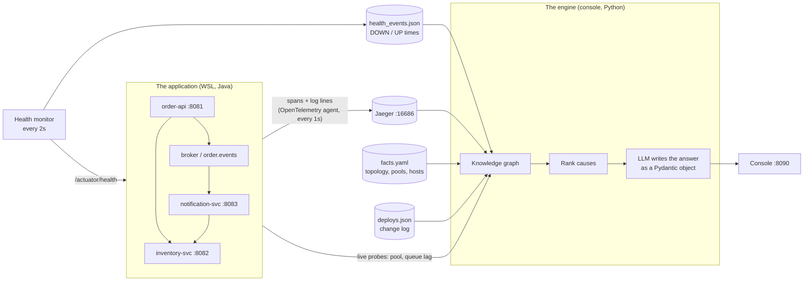

# How the demo works: a dry run, and where every number comes from

Use this to rehearse the talk and to answer the question every audience asks:
**"Where is this data coming from, and is the AI making it up?"**

Short answer for the room:

> Every request in the app is recorded by OpenTelemetry and stored in Jaeger.
> A health monitor pings every service every two seconds. When you ask a
> question, the engine reads those two sources, builds a map of how the services
> depend on each other, works out which component best explains what is failing,
> and only then hands that evidence to the LLM. The LLM writes the explanation.
> The numbers on screen are measured, not generated.

---

## 1. The pipeline at a glance



Five inputs, each with a different level of trust:

| Source | What it knows | Who writes it |
|---|---|---|
| **Jaeger** (traces) | Every request: which services it touched, how long each took, which failed and with what error, plus the log lines it wrote | The OpenTelemetry Java agent, attached to each service at startup. No code changes beyond a small logging hook |
| **Health monitor** | Is each service answering right now, and the exact second it stopped or came back | `kag/monitor.py`, inside the console, polling `/actuator/health` every 2 s |
| **Live probes** | Database pool usage, queue consumer lag | `/admin/pool` on inventory-svc, `/admin/stats` on notification-svc, read at question time |
| **facts.yaml** | What runs where, who calls whom, which pool belongs to which service | Checked in. In real life: your CMDB, Helm values or Terraform |
| **deploys.json** | Recent changes (deploys, config values) | Written by `ops/demo.sh` when a scenario redeploys something |

---

## 2. Dry run: what happens, step by step

### Start (`START-DEMO.cmd`)

1. Jaeger starts in WSL, listening for traces on port 4317 and serving its UI on 16686.
2. The four services start, each with `-javaagent:opentelemetry-javaagent.jar`. The agent
   instruments HTTP, JMS and JDBC automatically, and sends finished spans to Jaeger every second.
   Each service is tagged with a host name (`host-a` / `host-b`) that matches `facts.yaml`.
3. The console starts on Windows (`kag/ui.py`) and starts the health monitor thread.
4. The browser opens `http://localhost:8090`.

### "Start steady traffic"

Four background workers in the console send a request every ~0.35 s each: 80% `POST /orders`,
20% `GET /products/{sku}/availability`. Each order becomes one trace that crosses three services:

```
POST /orders (order-api)
 ├─ POST /inventory/{sku}/reserve (inventory-svc)
 │   └─ SELECT / UPDATE stock (H2 database)
 └─ publish order.events (order-api) ──► process order.events (notification-svc)
                                            └─ GET /inventory/{sku}/stock (inventory-svc)
```

The trace id travels across HTTP and across the JMS queue, so one order is one trace, and the
same id appears in the log lines of every service that handled it.

### "Ask" (the four stages on screen)

| Stage | What it does | Takes |
|---|---|---|
| **OBSERVE** | Health-checks all four services; pulls up to 500 recent traces per service from Jaeger's API for the last 5 minutes; reads pool and queue stats; loads the change log and the monitor's DOWN/UP history | ~1 s |
| **SEED** | Turns what hurts into *symptoms*: a service not answering, ≥ 5% of requests failing, an edge p95 ≥ 1 s, queue lag ≥ 1 s, or one endpoint failing ≥ 50% of its calls | instant |
| **RANK** | Walks the knowledge graph backwards from the symptoms (up to 6 hops) and scores every component that could have caused them | instant |
| **REASON** | Sends the measurements, the timeline and the top 5 ranked causes to the LLM, which must answer by filling a fixed JSON schema (`Diagnosis` in `kag/report.py`) | 2-10 s |

### "Break something" (presenter controls)

| Control | What really happens | What the audience sees |
|---|---|---|
| **Inject delay** | `POST /admin/chaos/latency` on inventory-svc: every data fetch sleeps that long, *while holding a database connection* | Orders take longer; past 2 s order-api gives up and returns 504 |
| **Inject errors** | `POST /admin/chaos/errors`: that fraction of fetches throws "Stock lookup failed: storage read error" | Orders fail with 502; the error appears in Jaeger and the logs |
| **Stop** | `demo.sh kill <svc>`: the Java process is killed | Callers get "connection refused"; the card turns red within 2 s |
| **Heal everything** | Clears chaos, restarts anything down | Cards go green |

The chaos endpoints are hidden from Swagger and write no log line or change record. The only way
to find the cause is to reason from the telemetry, which is the point.

---

## 3. Where every element on screen comes from

### Header and service cards

| Element | Source |
|---|---|
| `Jaeger up` | Console calls Jaeger's `/api/services` every 2 s |
| `LLM groq · openai/gpt-oss-120b` | Which key is set (`kag/llm.py`). A ⚠ means a settings note: hover the badge to read it |
| `UP` / `DOWN` on each card, colours on the diagram | Latest result of the health monitor (`/actuator/health`, every 2 s, 2 s timeout) |
| Swagger / Health / Traces links | Each service's `/swagger-ui.html`, `/actuator/health`, and a Jaeger search for that service |
| The architecture diagram | Drawn from the known topology. Only the colours are live |

### Section 2: "Use it"

| Element | Source |
|---|---|
| Status code, response, ms | The real HTTP response from the service, proxied by the console |
| "open trace in Jaeger" | The service returns its trace id in an `X-Trace-Id` header |
| requests / succeeded / failed, the green-red bar | Counters kept by the console's traffic workers (last 60 requests in the bar) |

### Section 3: raw logs

| Element | Source |
|---|---|
| "40,457 log lines from 4 services…" | `demo.sh logs-json`: the last 5 minutes of the four services' log files in WSL, merged by timestamp, with stack traces kept together |
| `trace=…` links | Each log line carries the trace id (put there by the OpenTelemetry agent). Click it to open that request in Jaeger |

### Section 3: the answer

Using the run in the screenshot as the example:

| Element | Example | Where it comes from | Measured or generated? |
|---|---|---|---|
| OBSERVE | 4/4 services answering health checks; 501 traced requests in the last 5m | Health checks at question time; Jaeger traces (health checks and admin polling are excluded, they are not user traffic) | Measured |
| SEED | 1 symptom: order-api:errors | order-api failed ≥ 5% of its requests in the window or the last minute | Measured, by rule |
| RANK | top: inventory-svc (score 0.69, explains 1/1) | Knowledge-graph ranking, see section 4 | Computed, no LLM |
| REASON | structured answer received | The LLM's JSON passed the schema check and agrees with the measured health | - |
| Banner `DEGRADED` | | The worst measured service status. If the LLM disagrees (says healthy while a service is down), its answer is discarded | Measured |
| Answer sentence | "order-api is experiencing errors because inventory-svc…" | Written by the LLM from the evidence it was given | Generated |
| Root cause | inventory-svc | Chosen by the LLM, normally the top-ranked candidate; must be a real component name | Generated, constrained |
| Started / Ended | 21:04:38 / 21:05:42 | Copied from the timeline the LLM was given: the health monitor's UP→DOWN and DOWN→UP lines, and first/last failed request times from Jaeger | Measured, selected by the LLM |
| Affected | order-api, inventory-svc | Services with symptoms or failures | Generated from measured data |
| How it spread | 1. inventory-svc DOWN 2. order-api calls inventory-svc fail… | The causal path the ranking found, put in words | Generated from the graph path |
| Evidence | "health monitor saw UP -> DOWN at 21:04:38", "503 x136, 504 x12…", "Connection refused" | Quotes from the monitor history, Jaeger error counts and the error messages on failed spans | Measured, quoted |
| What to do | Check health and logs… | Written by the LLM | Generated |
| Services right now (table) | order-api DEGRADED, slow: p95 2776 ms (last minute) | Health checks plus Jaeger: error rate and p95 from the last minute when there is enough traffic, else the 5-minute window | **Measured, never generated** |
| "Structured answer" | the JSON | The `HealthReport` Pydantic object, exactly as the console received it | - |
| "What the LLM was given" | the prompt | The full text the LLM saw: measurements, timeline, ranked subgraph. Nothing else | - |

Why order-api can be DEGRADED while inventory-svc is HEALTHY in the table: the table says what is
true *right now*, the incident card says *what happened*. In the example, inventory-svc had already
recovered, but order-api's last minute still contained slow requests from the delay.

### Section 4: presenter controls

| Element | Source |
|---|---|
| `now: delay 0 ms, error rate 0` | `GET /admin/chaos` on inventory-svc |
| Command output box | Output of `ops/demo.sh` for stop / restart / heal |
| Health monitor transitions | `kag/health_events.json`, written by the monitor whenever a service's health changes, with the reason (`connection refused`, `no response`, failing component) |

A note on `no response` during **Inject delay**: the delay holds a database connection while it
sleeps. Under traffic the pool fills up, and the service's own health check, which also needs a
connection, cannot answer within 2 s. The monitor records that as DOWN (no response). This is
real behaviour: a saturated service stops answering its health check, which is why the assistant
may describe it as "unresponsive" or "down" during a delay.

---

## 4. The knowledge graph and the ranking (what "KAG" means here)

The engine does not search logs for keywords. It builds a graph of the system and asks:
**which component, if broken, would explain everything we see?**

**Nodes:** services, hosts, the queue, the database, the connection pool, config items,
deployments, and the symptoms found in SEED.

**Edges, and which way failure spreads:**

| Edge | Meaning | If the first breaks… |
|---|---|---|
| order-api CALLS inventory-svc | HTTP dependency (declared, confirmed by traces) | the caller fails |
| inventory-svc USES_POOL inventory-pool | the service needs its DB pool | the service fails |
| broker HOSTS order.events | the queue lives on the broker | the queue stops |
| notification-svc CONSUMES_FROM order.events | async consumer | either side can back up the other |
| service RUNS_ON host | shared machine | every service on it |
| deploy CHANGED config → CONFIGURES pool | a change set a value | what it configures |

**Scoring each candidate** (`kag/kag_engine.py`):

| Factor | Weight | Question it answers |
|---|---|---|
| Blast fit | 0.35 | Does it explain *all* the symptoms, not just one? |
| Mechanism | 0.30 | Is every hop between it and the symptom independently corroborated (failing, slow, or down)? |
| Recent change | 0.20 | Was it changed recently? (half-life 20 minutes) |
| Anomaly | 0.15 | Is it itself visibly broken (health check failing, errors starting inside it)? |
| Depth | −0.05 | Small penalty for being far away |

Components that live probes show are healthy are ruled out ("exonerated"): for example, a host is
not a suspect while another service on it is fine, and the pool is not a suspect while no thread is
waiting for a connection.

The LLM is given the top 5 candidates with their scores, paths and evidence, and must cite them.
That is the difference from pasting logs into a chat window. The `/classic` page shows that
comparison side by side.

---

## 5. What the LLM can and cannot do

| The LLM… | |
|---|---|
| **sees** | the question, the measured service table, the timeline, the top 5 ranked causes with evidence (see "What the LLM was given") |
| **does not see** | raw log files, source code, or anything not in that prompt |
| **must answer** | as JSON matching `Diagnosis` (`kag/report.py`): status, answer, incident (title, root cause, category, started/ended, chain, evidence, remediation), confidence. Validated with Pydantic; one corrective retry if invalid |
| **cannot change** | the services table (measured), or the overall status (taken from measurements) |
| **gets overruled** | if it says healthy while something is down, or the reverse. The rule-based answer is shown instead, with the reason |
| **is optional** | with no key, or if the call fails, a rule-based answer fills the same format, so the demo never shows a blank |

---

## 6. Rehearsal checklist (do this once before the talk)

1. `git pull` on the branch, then in `kag\`: `py llm.py` should show `provider : groq`,
   a model, and `test call: OK`.
2. Run `START-DEMO.cmd` and check that four cards are green and the Jaeger badge says up.
3. Click **Place order**, then **open trace in Jaeger**: one trace, three services. Click the
   inventory-svc span and open **Logs**.
4. **Start steady traffic** and wait 20 s. Ask "Is anything breaking?" and expect **HEALTHY**.
5. Inject delay 2500 ms and wait 20 s. **Show raw logs**, then ask "Orders are failing, why?"
   and expect inventory-svc as root cause with a start time.
6. **Heal everything** and wait 60 s. Ask "Is it fixed?" and expect HEALTHY with the incident
   reported as resolved.
7. Stop inventory-svc and wait 15 s. Ask "What is down, why, since when?" and expect DOWN with
   the exact time from the monitor.
8. **Before the audience arrives: `STOP-DEMO.cmd` then `START-DEMO.cmd`.** The assistant looks
   at the last 5 minutes, so a fresh start makes the first answer a clean HEALTHY.

---

## 7. Questions the audience will ask

**"Did you have to change the application code to get this?"**
Tracing: no. The OpenTelemetry Java agent is attached at startup. The only additions are a
logging hook that copies log lines into the trace (`services/log-to-trace`), the `X-Trace-Id`
response header, and the demo's chaos switch.

**"Is the AI making up the numbers?"**
No. The services table and the overall status are measured. The LLM writes the explanation and
picks the root cause from ranked candidates, and its answer is rejected if it contradicts the
measurements. Expand "What the LLM was given" to show exactly what it saw.

**"Why not just give the logs to ChatGPT?"**
40,000 lines in 5 minutes don't fit, are mostly noise, and say nothing about which service depends
on which. The graph narrows them to the few facts that matter, and ranks causes by whether they
explain all the symptoms. The loudest error is often not the cause.

**"How does it know *when* it broke?"**
Two clocks: the health monitor records the second a service stops answering, and Jaeger records
the time of every failed request. The answer's start time is copied from those, not estimated.

**"Would this work on our system?"**
The inputs are standard: OpenTelemetry traces (any language), health endpoints, and a description
of the topology (`facts.yaml`, normally generated from a CMDB or infrastructure code).

**"Which model is it?"**
Shown in the header badge and at the bottom of every answer. Groq (`openai/gpt-oss-120b`) or
Anthropic Claude, depending on the key. Without a key, rule-based.
